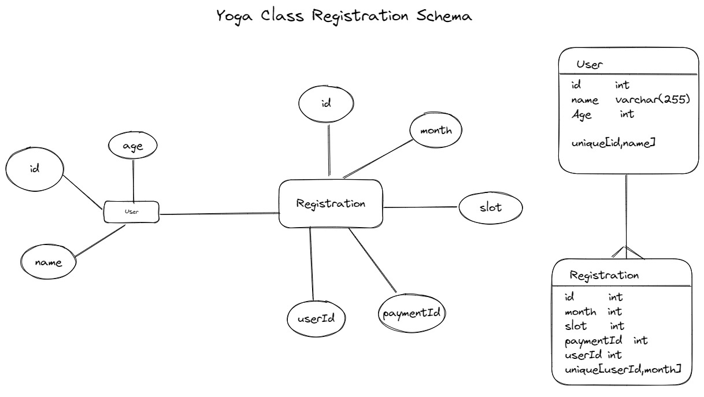

# Yoga-Form-Backend

- ## Database Schema

  

- ## Approach

  1. PlanetScale is used as Database.
  2. Database schema is defined in `/prisma/schema.prisma`.
  3. Create User with validations at `<Deployed URL>/users/create` .
  4. Create Registation at `<Deployed URL>/enroll/new` with reuired data. `completePayment()` middleware checks for paymentID at this route.

- ## Deployment

 1. Run `docker build -t yoga-backend .` .
 2. Push Image to Container Registry.
 3. Run `docker run -p 5000:5000 yoga-backend` by pulling from container registry on cloud.
